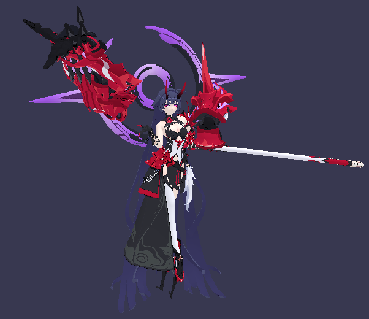
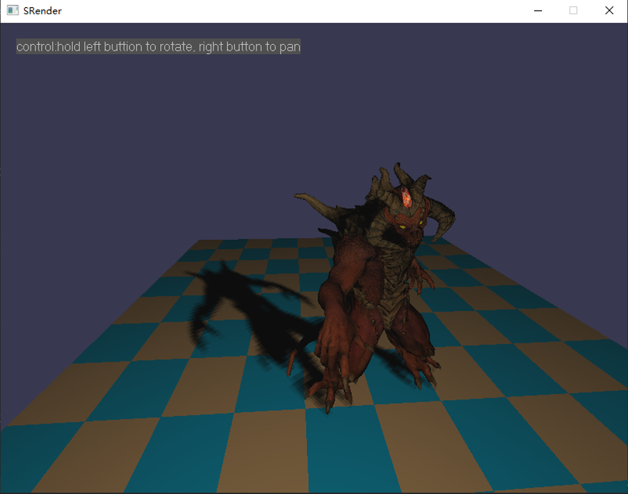
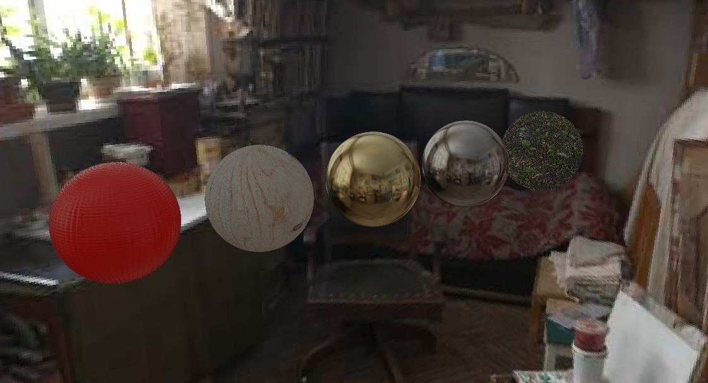
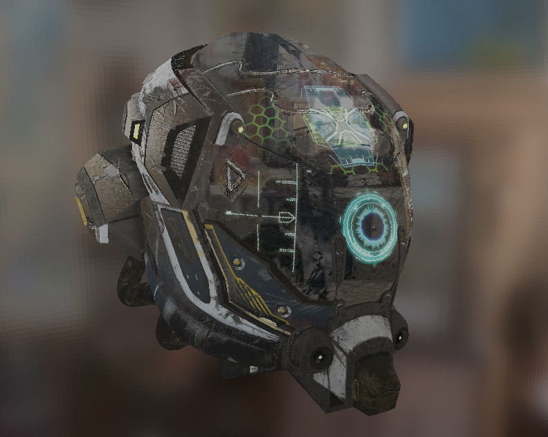
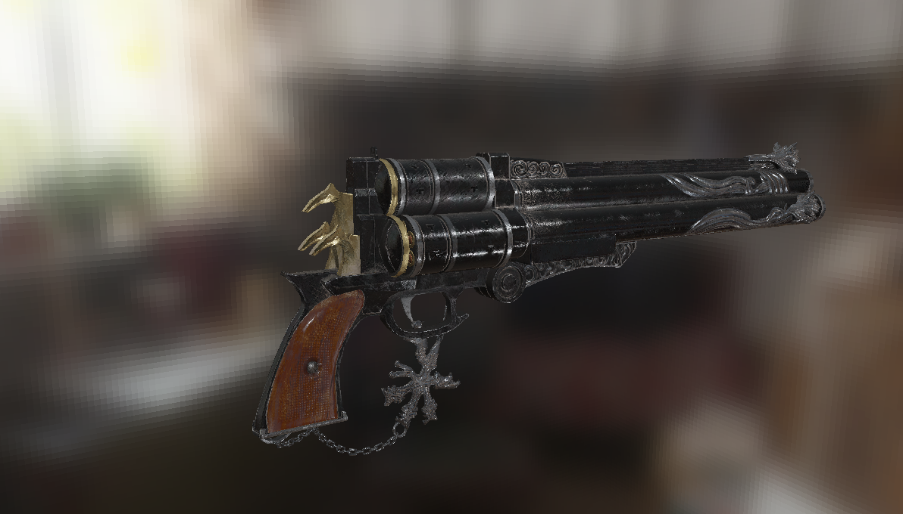

---

---

#  SRender

成果展示

### Blinn-Phong Shading

### ShadowMap

### Image_based_lighting

## Main Features

* 齐次裁剪、背面剔除

* 透视矫正插值

* 立方体贴图

* Shadow Map 和 PCF

* Bling-Phong 

* PBR 和 金属工作流

* Image based lighting

  

  

